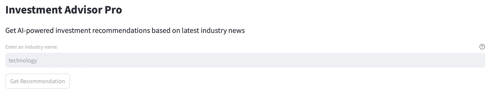
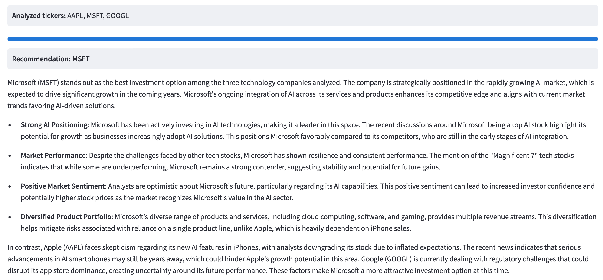
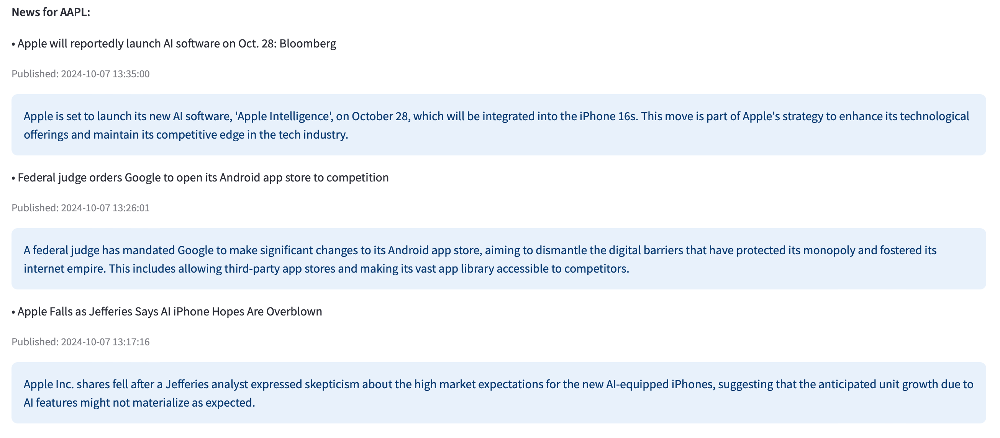

# AI Investment App


Welcome to AI Investment App! 🚀 

This application leverages large language models to analyze recent news summaries on companies and generate investment recommendations. By entering an industry name, the AI identifies the top three companies within that sector and evaluates their latest news to determine the most promising investment opportunity.


## Table of Contents
<!-- - [Overview](#overview) -->
- [Features](#features)
- [Dependencies](#dependencies)
- [Usage](#usage)
- [Examples](#examples)
- [Technologies Used](#technologies-used)
- [License](#license)

<!-- ## Overview
The AI Image Classifier app enables users to upload an image and receive a classification from various categories like 'Dog', 'Cat', 'Car', etc. This is useful for quickly categorizing large datasets of images. -->

## Features
- **News Scraping:** The application scrapes financial news from sources like CNBC and Yahoo Finance. It uses python libraries `requests` and `BeautifulSoup` to fetch and parse web content. The scraped articles are saved locally with metadata like title, source, and timestamp.
- **Investment Recommendation:** The app uses a language model to analyze news summaries and recommend investments. The companies news are scraped and summarized by `Crawl4ai`'s `LLMExtractionStrategy` with options of using `OpenAI's GPT models` or `Ollama's LLaMA 3` model, which is compatible with OpenAI's API format but runs locally.
- **Local LLM Integration:** The app is configured to use `Ollama's LLaMA models locally`, leveraging their OpenAI-compatible API. This setup involves running a local server and using a placeholder API key ('ollama'), which is required but not used for authentication.

## Dependencies
### Required Software
- **Python**: Ensure you have Python 3.9 or later installed on your system. You can download Python from the official [Python website](https://www.python.org/downloads/).
- **Ollama**: A tool for running LLM locally. You can download Ollama from the offical [Ollama website](https://ollama.com/). 

### OpenAI API Key
If you want to use OpenAI GPT models, please ensure you have the OpenAI API Key set up in your environment.
1. Obtain your API Key

   Go to [OpenAI’s API Key page](https://platform.openai.com/api-keys).
   Log in and create a new API key if you haven't already.
2. Set Up the API Key in Your Environment

   **Linux/macOS:** 

   Open your terminal and add the key to your `.bashrc`, `.bash_profile`, or `.zshrc file`:
   ```bash
   export OPENAI_API_KEY="your-api-key-here"
   ```
   Then, reload your shell configuration by running:
   ```bash
   source ~/.bashrc  # or `source ~/.zshrc` if you used .zshrc
   ```
   **Windows:** 

   Open Command Prompt and set the environment variable:
   ```bash
   setx OPENAI_API_KEY "your-api-key-here"
   ```
   You may need to restart your terminal or IDE to access the variable.

## Usage
1. Clone the repository:
   ```bash
   git clone https://github.com/giantgenai/ai-investment-advisor.git
   cd ai-investment-advisor
2. Set up a virtual environment:
   ```bash
   python -m venv .venv
   source .venv/bin/activate
3. Install dependencies:
   ```bash
   pip install -r requirements.txt
4. Run the app:
   ```bash
   streamlit run app/investment_app.py
## Examples
- Enter the industry you're interested in and click `Get Recommendation`: E.g. Finance



- Investment App will investigate 3 most promising companies and give a recommendation for which one to invest based on their recent news:



- Reference to those news of the companies are provided at the end:



## Technologies Used
- Data orchestration: LlamaIndex
- Large language Model: OpenAI GPT-4o-mini, Llama 3.2
- Web Crawler: BeautifulSoup, Crawl4ai
- Application: Streamlit 

## License
This project is licensed under the MIT License - see the [LICENSE](LICENSE) file for details.